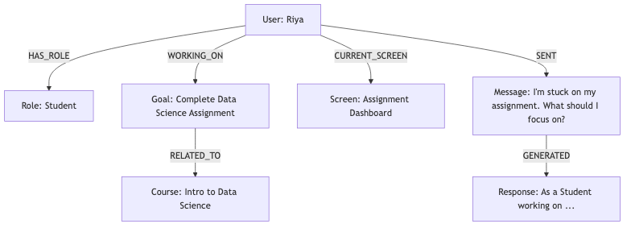

# Bridge-It: Context-Aware AI Assistant

## Overview
Bridge-It is a context-aware AI chatbot designed to provide personalized, relevant, and consistent responses by leveraging a dynamic context graph and a vector-based knowledge store. The system is modular, extensible, and built for educational and productivity use cases.

## Architecture

### Main Components

- **app.py**: Entry point; orchestrates the workflow, user interaction, and graph-based context management.
- **graph_store.py**: Implements the `ContextGraph` class for storing and querying user context as a property graph (nodes and edges).
- **vector_store.py**: Implements a simple vector store for semantic search over knowledge snippets.
- **llm.py**: Handles LLM-based response generation.
- **baseline.py**: Provides a baseline (non-contextual) response for comparison.

### Workflow
1. **User Initialization**: On first interaction, user profile, role, goal, screen, and course are added to the context graph.
2. **Message Handling**: For each user message:
   - The user's context subgraph is retrieved.
   - Relevant knowledge is retrieved from the vector store using semantic search.
   - A prompt is constructed combining the user message, context graph, and relevant knowledge.
   - The LLM generates a response based on this prompt.
   - The conversation (message and response) is stored in the context graph for traceability.

### Design Decisions
- **Context Graph**: Chosen for its flexibility in representing complex, evolving user states and relationships (e.g., roles, goals, screens, courses). Enables fine-grained, structured context retrieval.
- **Vector Store**: Complements the graph by providing unstructured, semantic knowledge retrieval for open-ended queries.
- **Modular Nodes**: Each workflow step (context retrieval, prompt building, response generation, conversation storage) is a separate function, making the system easy to extend or modify.
- **Baseline Comparison**: Including a baseline response highlights the value added by context-aware reasoning.

## How the Context Graph Improves Response Quality

- **Personalization**: The graph encodes user-specific information (e.g., current goal, course, screen), allowing the assistant to tailor responses to the user's situation.
- **Relevance**: By retrieving only the subgraph relevant to the current user, the assistant focuses on contextually appropriate information, reducing generic or off-topic answers.
- **Consistency**: Storing conversation history and user state in the graph ensures that the assistant can maintain continuity across multiple interactions, referencing past goals, roles, or actions.
- **Extensibility**: New node/edge types (e.g., achievements, preferences) can be added without major refactoring, supporting richer context over time.

## Context Graph Design

### Definition of Context Nodes and Relationships

The context graph is a property graph where:
- **Nodes** represent entities such as Users, Roles, Goals, Screens, Courses, Messages, and Responses.
- **Edges** represent relationships between these entities, such as HAS_ROLE, WORKING_ON, CURRENT_SCREEN, RELATED_TO, SENT, and GENERATED.

#### Example Node Types
- **User**: `{id: user_1, type: User, name: "Riya"}`
- **Role**: `{id: role_user_1, type: Role, value: "Student"}`
- **Goal**: `{id: goal_user_1, type: Goal, title: "Complete Data Science Assignment"}`
- **Screen**: `{id: screen_user_1, type: Screen, name: "Assignment Dashboard"}`
- **Course**: `{id: course_user_1, type: Course, name: "Intro to Data Science"}`
- **Message**: `{id: msg_<hash>, type: Message, text: <user_message>}`
- **Response**: `{id: res_<hash>, type: Response, text: <ai_response>}`

#### Example Edge Types
- `HAS_ROLE`: User → Role
- `WORKING_ON`: User → Goal
- `CURRENT_SCREEN`: User → Screen
- `RELATED_TO`: Goal → Course
- `SENT`: User → Message
- `GENERATED`: Message → Response

### Data Storage: Graph vs. Prompt Input
- **Stored in the Graph**: Persistent, structured user context (profile, roles, goals, current screen, courses, conversation history).
- **Prompt Input**: The current user message, the user's context subgraph (retrieved from the graph), and relevant knowledge snippets (from the vector store) are combined to form the prompt for the LLM.

### Example Graph Snapshot

Below is a structured representation of a sample user context graph:

```
User (user_1, name="Riya")
  ├── HAS_ROLE ──> Role (role_user_1, value="Student")
  ├── WORKING_ON ──> Goal (goal_user_1, title="Complete Data Science Assignment")
  │                     └── RELATED_TO ──> Course (course_user_1, name="Intro to Data Science")
  ├── CURRENT_SCREEN ──> Screen (screen_user_1, name="Assignment Dashboard")
  ├── SENT ──> Message (msg_123, text="I'm stuck on my assignment. What should I focus on?")
        └── GENERATED ──> Response (res_456, text="As a Student working on ...")
```

### Example Diagram



## Usage

1. Install dependencies:
   ```sh
   pip install -r requirements.txt
   ```
2. Run the assistant:
   ```sh
   python app.py
   ```
3. Follow prompts to create a user and interact with the assistant. Type `exit` to quit.

## Example

- User: "I'm stuck on my assignment. What should I focus on?"
- Assistant (with context): "As a Student working on 'Complete Data Science Assignment' in 'Intro to Data Science', you should review regression and classification concepts, and check the assignment's deadline and rubric."

## License
MIT
